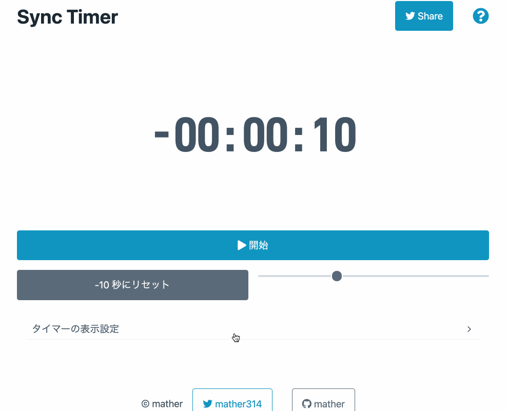

# Simple Stopwatch

[サービスサイト](https://sync-timer.netlify.app/)

同時視聴配信などで使えるシンプルなタイマーです。

映像をスタートするタイミングの同期のために開始する秒数を -30 秒から 30 秒の間で指定することができます。

## できること

- ストップウォッチのスタート、一時停止
- 開始秒数を指定してリセット
- 背景色、文字色の変更

## 現状できないこと

- フォントの変更

## 使い方

## ご意見・ご要望

対応できるかはわかりませんが、issue に記載してください。
