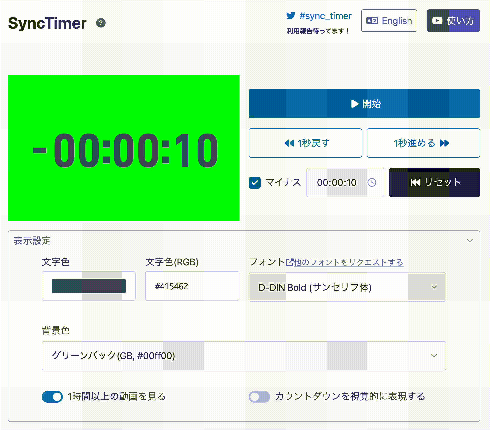

# Sync Timer

[サービスサイト](https://sync-timer.netlify.app/)

同時視聴配信などで使えるシンプルなタイマーです。

映像をスタートするタイミングに合わせるために、開始する秒数をマイナスから指定することができます。

## できること

- タイマーのスタート、一時停止
- タイマーを1秒進める、1秒戻す
- 開始秒数を指定してリセット
- 背景色、文字色、フォントの変更
- 時間部分の省略（アニメなど1時間未満の動画用）
- カウントダウンを視覚的に表現
- 背景色、文字色などの設定を URL に記録して、URLをコピーすることでOBSなどで再現できる

## 現状できないこと

- 任意のフォントへの変更
- 文字の縁取りなど見た目の細かい変更

## 使い方

## ご意見・ご要望

[こちらのフォームからどうぞ](https://docs.google.com/forms/d/e/1FAIpQLSfgmFqq-t-vv6gC1YpgoH3nCK1b7gI0ROC25K1NX9r5jGtndg/viewform?usp=sf_link)
